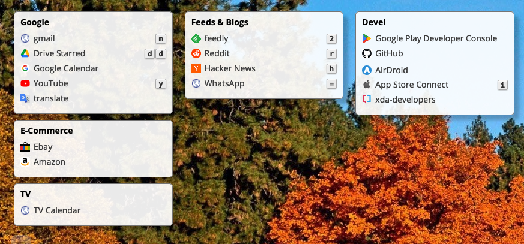

# What is this?

MyLinks shows bookmarks organised in widgets (all links related to google, e-commerce, development and so on)

- You can bind a shortcut combination to quickly open links
- Use your preferred wallpaper
- Open all widget links at once

The configuration file (JSON) is stored on your computer, no hosting on unknown servers, no privacy issues.

If you are not obsessed by privacy, you can use public urls containing the configuration.

# Show me how it works

Open [this link](https://dafi.github.io/mylinks/?c=https://gist.githubusercontent.com/dafi/8442bdbe932c22426bb4a383077a6802/raw/55b4d880d2015a96ec87424af48626d075a257a4/mylinks.json) to see MyLinks in action

# Configuration

## Load From url

Configuration can be read from remote urls passing the parameter `c`

    https://dafi.github.io?c=https://dafi.github.io/config.json

### Configurations shared on Dropbox

If configurations are stored on Dropbox be sure to replace `dropbox.com` with `dl.dropboxusercontent.com` to prevent `CORS` problems

    https://dl.dropboxusercontent.com/s/xxxxx/config.json?dl=1

## Eslint

    npx eslint --no-color src

## Stylelint

Ignore the `build` directory and use only `src`

    npx stylelint "src/**/*.css"

## Local deploy

Inside the `package.json` file changed `homepage` to `./` to work locally from `file://`

## Remote deploy

### On GitHub pages

There are two new scripts defined inside `package.json`

- predeploy
- deploy

Run the following command to deploy on [mylinks](https://dafi.github.io/mylinks/)

	npm run deploy

