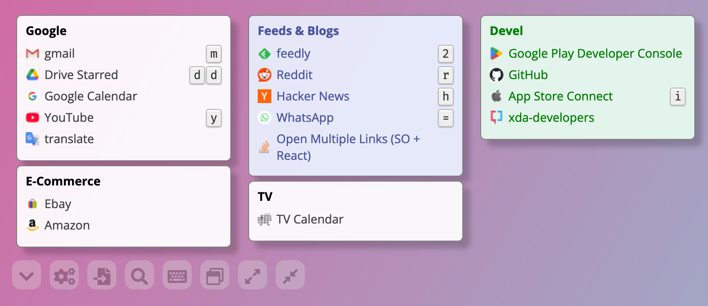

# What is this?

MyLinks is a dashboard of web links, a bit like browser bookmarks but shown on a single page

## The elephant in the room

Before continuing, we must say MyLinks **doesn't handle** embedded elements like emails, service status, smart home access panels and so on.

As the name implies, MyLinks, it's a dashboard to organize links.

*From now on, the term `widget` is used to define a box containing links.*

### Configuration is local, no cloud, no external servers

- Configuration does not leave the user's computer, it's saved on the browser storage (localStorage for tech people)
- Configuration can be exported as JSON and saved on local disk, it's just a simple file!
- Of course, if you can export, you can also import...

# What MyLinks does

### Organize links

- Arrange links in a grid that can hold as many widgets as the user desires
- The columns and rows in the grid are defined by the user
- It is possible for users to organize links into widgets. One example is to make a widget called 'Social' and include links to Facebook, Instagram, and X
- Drag and drop can be used to reposition widgets
- Drag and drop can also be used to move links between different widgets

### Dark mode, layout and look and feel

- Dark mode is supported. By default, it uses the system color scheme, but it's possible to override it.
- All links are visible, but widgets (such as those that are less frequently used or too long) can be collapsed to save screen space.
- The collapsed widgets appear when the mouse hovers on them, so it's always possible to click them.
- The background can be modified by selecting a wallpaper URL.

### Opening links

- It's normal to open links by clicking on them, but it's annoying. Therefore, the user can simply press a keyboard shortcut to open any link.
- It's possible to open multiple links simultaneously.
- By clicking the widget toolbar icon or pressing the assigned key while the mouse is over the widget, all links contained inside it can be opened.

### Link icons

- The icons shown for links can be customized per single link or using a favicon retriever service (the most used is the google favicon service)
- We strongly recommend to use a favicon service because it's so useful identify link by its logo, see the [Favicon service](favicon_service.md) for more details

### Search

- Links can be picked using fuzzy search, just open the search dialog and go!
- The search dialog can be open using a shortcut key (defined by the user)

# Show me how it works

Open [this link](https://dafi.github.io/mylinks/?c=https://gist.githubusercontent.com/dafi/8442bdbe932c22426bb4a383077a6802/raw) to see MyLinks in action

# Configuration

## Load From url

Configuration can be read from remote urls passing the parameter `c`

    https://dafi.github.io?c=https://dafi.github.io/config.json

### Configurations shared on Dropbox

If configurations are stored on Dropbox be sure to replace `dropbox.com` with `dl.dropboxusercontent.com` to prevent `CORS` problems

    https://dl.dropboxusercontent.com/s/xxxxx/config.json?dl=1

## Eslint

    npx eslint --no-color src

## Stylelint

Ignore the `build` directory and use only `src`

    npx stylelint "src/**/*.css"

## Local deploy

Inside the `package.json` file changed `homepage` to `./` to work locally from `file://`

## Remote deploy

### On GitHub pages

There are two new scripts defined inside `package.json`

- predeploy
- deploy

Run the following command to deploy on [mylinks](https://dafi.github.io/mylinks/)

	npm run deploy

# Thank you for supporting MyLinks

We're thankful to these companies for offering their services for free:

